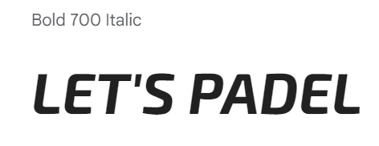
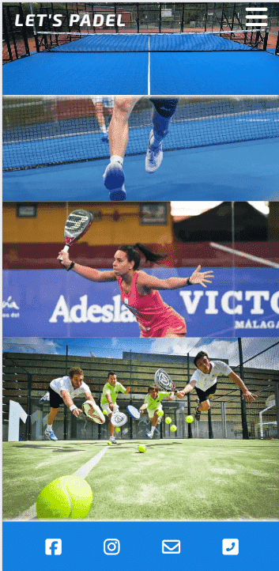
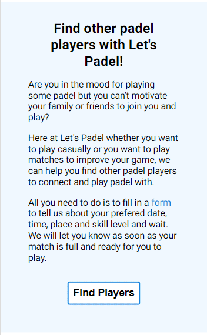
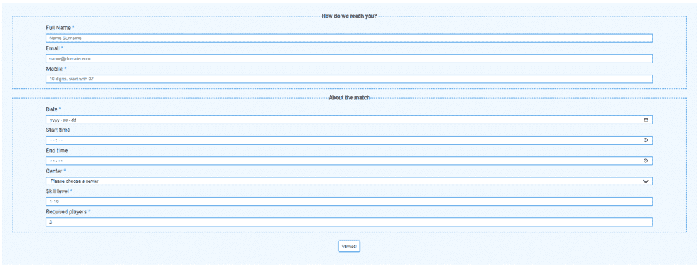
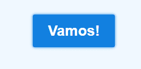
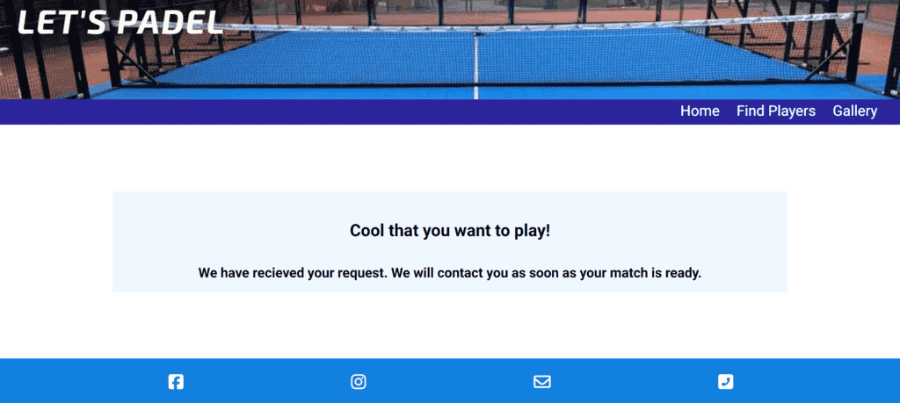

# Let's Padel

Visit the deployed site: [Let's Padel](https://fariba-kamani.github.io/lets-padel/)

Let's Padel is a growing community for everyone who loves playing Padel regardless of gender, age, or skill level. As a padel player myself I usually struggle to find other people to play with when I have spare time and can play. I would have played Padel more often if I had access to more Padel players beyond those in my contact list. I thought this could as well be one of the obstacles for other Padel players like me out there. By creating Let's Padel I am trying to address this issue and help facilitate for Padel players to find and connect and hopefully be able to play Padel as often as they desire.

The way the website works is very straightforward and intuitive. All that needs to be done is for the player to fill in a form, informing us about when and where she/he wants to play, the skill level the player has, and how many players are needed to be able to play a match. We will then try to find other players with the same preferences. Once we have identified all the necessary players, we will reach out to them using the contact details provided in the submitted form.

## CONTENTS

* [User Experience](#user-experience-ux)
  * [User Stories](#user-stories)

* [Design](#design)
  * [Colour Scheme](#colour-scheme)
  * [Typography](#typography)
  * [Imagery](#imagery)
  * [Wireframes](#wireframes)
  * [Features](#features)
    * [The Home Page](#the-home-page)
    * [The Players Page](#the-find-players-page)
    * [The Gallery Page](#the-gallery-page)
  * [Accessibility](#accessibility)

* [Technologies Used](#technologies-used)
  * [Languages Used](#languages-used)
  * [Frameworks, Libraries & Programs Used](#frameworks-libraries--programs-used)

* [Deployment & Local Development](#deployment--local-development)
  * [Deployment](#deployment)
  * [Local Development](#local-development)
    * [How to Fork](#how-to-fork)
    * [How to Clone](#how-to-clone)

* [Testing](#testing)
  * [Solved Bugs](#solved-bugs)
  * [Known Bugs](#known-bugs)
  
* [Credits](#credits)
  * [Code Used](#code-used)
  * [Content](#content)
  * [Acknowledgments](#acknowledgments)

- - -

## User Experience (UX)

### User Stories

#### First Time Visitor Goals
* I would like to try Padel or play Padel occasionally, and I want to find people to play with.
* I have a different schedule from my padel friends, so I’m looking for other padel players who have a similar schedule to mine.
* I want the website to be intuitive and easy to use.
* I want the website to be responsive and compatible with my device.

#### Returning Visitor Goals

* I want to be able to play Padel more frequently, and I want to find players on a more regular basis.
* Even if I spontaneously decide to play padel, I still want to know that there is a high chance I could find other players to play with by using the website.

#### Frequent Visitor Goals

* I want to be able to see what matches other players have requested and be able to independently join their matches.
* I want to be able to have an account on the website and be able to stay connected to my Padel friends via the website.
* I want to be able to independently upload pictures taken from my Padel experiences on the Gallery page.

- - -

## Design

### Colour Scheme

The Let’s Padel color scheme draws inspiration from the hues commonly seen on padel courts throughout Stockholm. These colors typically include blue, black, and white. The goal was to evoke the same feeling as being on a padel court while maintaining a minimalistic design to avoid visual overload, especially for users with Autism.

The header background features an image of a padel court, with the dominant color being rgb(18, 128, 223) or #1280DF. This color choice also influenced the footer color across all three web pages. To ensure readability, the menu bar links and Font Fantastic icons in the footer are white, creating contrast against the blue background.

The header title stands out with a slightly different white shade, rgb(250, 250, 243) or #FAFAF3, compared to other links in the navigation bar and footer. For desktop screens, a hovering effect changes the content color of the header and footer to rgb(230, 191, 49) or #E6BF31, maintaining contrast against their backgrounds.

On mobile screens, navigation links appear in a drop-down menu, opening on a transparent rich black background (rgba(1, 1, 21, 0.2)). This ensures visibility against the header background image while keeping the image itself visible. For tablet and desktop screens, a fixed navigation bar beneath the header image displays the navigation links at all times. To distinguish the navbar from the header image, I used rgb(44, 36, 155) or #2C249B.

The body sections alternate between white and Aliceblue backgrounds, aiding users in understanding where one section ends and another begins. Black is used for the font colour on the body to ensure contrast and better visibility.

Lastly, button borders (on all screen sizes) and the fieldset borders (on tablet and desktop screens) share the same blue color as the header image and footer, which is rgb(18, 128, 223). This design creates cohesion with the rest of the website’s color scheme while remaining noticeable to users.

### Typography

Google Fonts was used to import the chosen fonts for use on the site.

* For the page title, I have used the Google font Exo 2, which is described as a contemporary geometric sans serif typeface by [Google Fonts](https://fonts.google.com/specimen/Exo+2/about?preview.text=LET%27S%20PADEL&preview.size=42). I chose this font for the title because it looks playful and fun, which goes well with the agenda of the website.

* For the body of the page, I have used the Google font ‘Roboto’ because it is clean, readable, and easy on the eyes, making the user experience as smooth as possible. According to [Google Fonts](https://fonts.google.com/specimen/Roboto/about?query=roboto&selected=Material+Symbols+Outlined:sports_tennis:FILL@0;wght@400;GRAD@0;opsz@24&icon.size=24&icon.color=%235f6368), Roboto is featured in more than 695 million websites. Additionally, according to [Github](https://github.com/googlefonts/roboto), the font provides robust multi-language support and comes in various weights, styles, and alternate glyphs. 

* In case the imported Google fonts don’t load, both fonts will fall back to sans-serif.

### Imagery

All images used on the website have been resized using [Image Resizer.com](https://imageresizer.com/), converted to WebP format with [FreeConver](https://www.freeconvert.com/jpg-to-webp) and compressed using [tinify](https://tinypng.com/) to be optimized for using on the website and help loading the website faster for the users.

The headers on all three pages have a background image of a padel court taken from, https://psauction.com/item/view/975429/mobil-komplett-padelbana-instantpadel-duo-10x20m-ny-och-ej-monterad, to give the user the same feeling as being on the padel court.

You can see the URLs from which the images on the Gallery page are taken, in the list below. All of them have an alt attribute to display text if the image file doesn’t load, and to describe the image for screen readers used by visually impaired users.

* https://thumbs.dreamstime.com/b/serious-middle-aged-latin-man-tennis-player-playing-padel-friendly-match-outdoor-court-spring-focused-hitting-ball-267446063.jpg
* https://www.vanguardlawmag.com/wp-content/uploads/2024/04/IMG_5960.jpg
* https://www.lta.org.uk/49d339/siteassets/play/padel/image/woman-playing-padel2.jpg?w=3200"
* https://tennis-uni.com/wp-content/uploads/padel-tennisspieler-netz-400x267.jpeg
* https://media.istockphoto.com/id/1413274533/photo/four-senior-friends-enjoying-together-while-playing-padel.jpg?s=612x612&w=0&k=20&c=ZuI09DB7woiuqmYD-J5dlzg1ID5VOSoh6m_7gFII4_E="
* https://thepeninsulaqatar.com/get/maximage/20240303_1709445598-694.jpg?1709445599"
* https://thepadelstate.com/wp-content/uploads/2024/02/Sofia-Arujo-1021x500.jpg
* https://rutinasdeportivas.es/medios/2017/01/Quieres-saber-cu%C3%A1les-son-los-beneficios-del-p%C3%A1del-y-porque-es-importante-practicarlo-parejas.jpg

### Wireframes

Wireframes were created for mobile, tablet and desktop using balsamiq.

| Screen size | Home | Find a match | Gallery |
| :--- | :--- | :--- | :--- |
| mobile |  |  |  |
| tablet |  |  |  |
| desktop |  |  |  |

### Features

The website consists of a home page, a Find Players page and a Gallery page.

All Pages on the website are responsive and have the following features:

* A favicon in the browser tab.

  

* The title of the site at the top of every page. This title also acts as a link back to the home page, and it turns into a saffron yellow color when hovered over on desktop screens.

  
  

* **Drop down navigation menu for mobile screens**  

    

  * **Underlining the active page in the navigation menu**
  * **Navigation menu for screens larger than tablets**
  
    

  * **Navigation links turn into Saffron yellow color with an underline of the same color when hovered over on desktop screens** 

    
  

* The footer of the site, located at the bottom of every page, features links to the website’s Facebook, Instagram, email, and phone. These links are displayed using Font Awesome icons. When hovered over on desktop screens, each icon changes to a Saffron yellow color.

  

* White shadow underneath the navigation bar and above the footer to create more distinction between them and the body content for the user.

  

#### The Home Page

* **The landing section**

  

* **The second section; about the website, its purpose, and how it works.**
  * **The ‘Find Players’ button, as well as the word ‘form,’ sends users to the Find Players page.**

    

  * **Responsive button that turns blue with white text when hovered over on desktops**
  * **Responsive content. The paragraphs show in columns for screens larger than tablets**

    

* **Benefits of padel section with font fantastic intuitive icons and responsive content**

#### The Find Players Page

  * **Page title and quick instructions for the users**

    

  * **The submit form with two fieldsets and the Vamos button for submitting the form**
  * **Added fieldset border for more visible sectioning on screens larger than tablets**

    

  * **Hover effect for Vamos button on desktops**

    

  * **The submission page opens to inform the user that the form has been successfully submitted.** 

    

#### The Gallery Page

  * **The page title to let the users know that they can share their photos**

    

  * **Masonry design for displaying the Gallery photos**
  * **Added hover effect to gallery images to make them bigger when hovered over**

    

#### Future Implementations

In future implementations I would like to:

1. Display the matches that users have requested on the website, allowing other users to send requests to join available matches while the match hasn’t become full.
2. Update the displayed matches and remove old ones from the display.
3. Allow users to have an account on the website to: 
   * Add other players to their friend list. 
   * Send messages. 
   * Keep a record of played matches. 
   * View the status of the match they have requested.

### Accessibility

I have been mindful during coding to ensure that anyone can understand my website, regardless of auditory, visual, or physical disability.

* Semantic HTML has been used to help both the browser understand the content and provide screen readers with extra functionality for keyboard operation, rather than relying solely on a mouse.
* Semantic text structure, such as headings, paragraphs, and lists, has been used to help screen readers provide the indicators they need to read out the content in a useful way.
* Semantic structural elements, such as nav, header, section, and footer, have been used to provide screen readers with important information that can be conveyed to their users.
* UI controls, such as links, buttons, and forms, have been used to allow users to interact with the website. By browser default, they can be accessed using a keyboard or by clicking the tab key to jump from one UI control to another.
* Form labels have been used so that screen readers can clearly label input fields for users.
* The aria-label attribute has been used to provide a more meaningful description for icons, links, background images, and interactive elements, specifically for screen reader users.
* Use a hover state on all buttons on the site to make it clear to the user whether they are hovering over a button.
* Use a sensible font, font sizes, line heights, color contrast for the text content and sticking to common conventions to make the website intuitive, easy to read and follow for all users.

- - -

## Technologies Used

### Languages Used

HTML and CSS

### Frameworks, Libraries & Programs Used

* [Balsamiq](https://balsamiq.com/) - Used to create wireframes.

* [Git](https://git-scm.com/) - For version control.

* [Github](https://github.com/) - To save and store the files for the website.

* [GitPod](https://gitpod.io/) - IDE used to create the site.

* [Google Fonts](https://fonts.google.com/) - To import the fonts used on the website.

* [Chrome DevTools](https://developer.chrome.com/docs/devtools) - To troubleshoot and test features, solve issues with responsiveness and styling.

* [Favicon generator](https://realfavicongenerator.net/) To create favicon.

* [Am I Responsive?](http://ami.responsivedesign.is/) To show the website image on a range of devices.

* [Tinify](https://tinypng.com/) To compress images.

* [Image Resizer.com](https://imageresizer.com/) To resize and compress images. 

* [FreeConver](https://www.freeconvert.com/jpg-to-webp) To convert the images to webp format.
 
* [Microsoft Bing Copilot Tools](https://www.bing.com/chat) - An AI chat that I used to check the spell and grammar of my website and README.md file.
- - -

## Deployment & Local Development

### Deployment

The site is deployed using GitHub Pages - [Let's Padel](https://fariba-kamani.github.io/lets-padel/).

To Deploy the site using GitHub Pages:

1. Login (or signup) to Github.
2. Go to the repository for this project, [fariba-kamani/lets-padel](https://github.com/fariba-kamani/lets-padel).
3. Click the settings button.
4. Select pages in the left hand navigation menu.
5. From the source dropdown select main branch and press save.
6. The site has now been deployed, please note that this process may take a few minutes before the site goes live.

### Local Development

#### How to Fork

To fork the repository:

1. Log in (or sign up) to Github.
2. Go to the repository for this project, [fariba-kamani/lets-padel](https://github.com/fariba-kamani/lets-padel)
3. Click the Fork button in the top right corner.

#### How to Clone

To clone the repository:

1. Log in (or sign up) to GitHub.
2. Go to the repository for this project, [fariba-kamani/lets-padel](https://github.com/fariba-kamani/lets-padel)
3. Click on the code button, select whether you would like to clone with HTTPS, SSH or GitHub CLI and copy the link shown.
4. Open the terminal in your code editor and change the current working directory to the location you want to use for the cloned directory.
5. Type 'git clone' into the terminal and then paste the link you copied in step 3. Press enter.

- - -

## Testing

Please refer to [testing](TESTING.md) file for all testing carried out.

### Solved Bugs

An issue was reported after some friends with iPhones had tested the website. The text content “Vamos!” wasn’t showing on the submit button on the Find Players page in iPhone devices. Troubleshooting for this problem was quite hard and time-consuming, as the submit button was performing just as expected on all screen sizes in Chrome DevTools. However, the issue was very specific to iPhones. I solved this issue by moving the styles targeting the submit button above the styles targeting the input and selection fields in style.css, ensuring they wouldn’t be overridden by iPhone’s default styles.

Another issue occurred after I created my initial README.md file on GitHub, not directly in my IDE workspace. I committed the changes on GitHub, but afterward, I couldn’t add, commit, or push the changes in my workspace. I had to pull from the origin and seek assistance from a Code Institute tutor to merge the README.md file I had created and committed to the repository remotely from outside of the IDE.

### Known Bugs

The fields related to input type="date" and input type="time" don’t adhere to the intended CSS styles when displayed on iPhones. After spending a considerable amount of time troubleshooting and seeking a solution for this issue, and discussing it with my mentor and tutors, it appears that this discrepancy may be due to iOS Safari compatibility and the fact that input types for time and date are not fully supported across all browsers. For now, I’ve decided to accept the fact that these input fields will appear slightly different when displayed on iPhones.

- - -

## Credits

### Code Used

Throughout the entire project developement I have used the Code Institute course material for HTML and CSS. I have used the tutorials for Love Running walkthrough project represented on the course in order to set up and get started with my project properly, make a dropdown navigation menu using checkbox for mobile screens and make a masonry design for how the images display on the Gallery page.

I have used [Stack Overflow](stackoverflow.com) to get some ideas for how to use regular expression in order to define patterns for the form input validation of input type="text" and input type="tel".

I have as well used the tutor support for how to link to email and phone number in the footer in a way that the user will be linked to user's email client with a specified recipient by using the code  and trigger a phone call (for mobiles) by clicking the phone icon link in the footer, using the code . 

### Content

For documentation and creating my README.md file I have taken inspiration from the sample README.md file that my mentor shared with me [The Quiz Arms](https://github.com/kera-cudmore/TheQuizArms/blob/main/README.md) as well as the README.md sample available on the course for Portfolio 1: Assessments Guide Preview.

I used an article available at google fonts in order to understand the critera for choosing a proper font type; [A checklist for choosing type](https://fonts.google.com/knowledge/choosing_type/a_checklist_for_choosing_type).

All the imagery I’ve used, along with the corresponding links, is provided in [Imagery](#imagery) section.

### Acknowledgments

I would like to acknowledge

* My Code Institute mentor, Jubril Akolade, for reviewing my project and inspiring me to improve my website.
* The Code Institute tutor team, who were available and guided me whenever I was stuck troubleshooting issues during the development of my project.
* My partner and friends, who took the time to test my website on their devices and provided constructive feedback.

