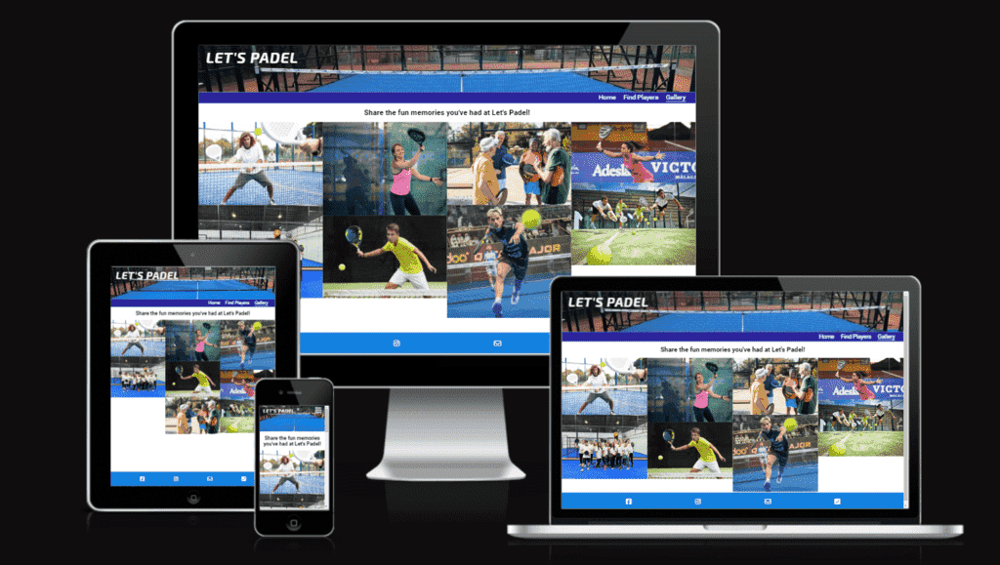
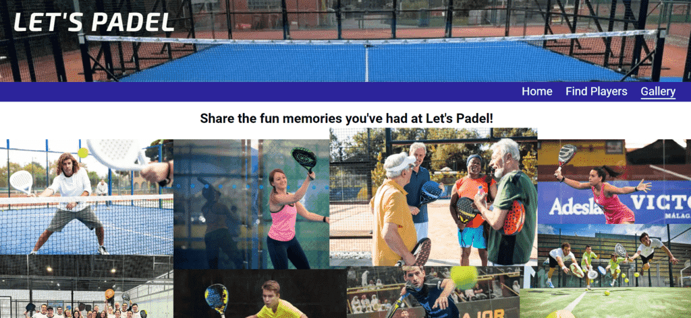

# Let's Padel

Visit the deployed site: [Let's Padel](https://fariba-kamani.github.io/lets-padel/)

Let's Padel is a growing community for every one who loves playing padel regardless of gender, age or skill level. As a padel player myself I usually struggle to find other people to play with when I actually have spare time and can play. I beleive I would have played padel more often if I had access to more padel players beyond those in my contact list. I thought this could as well be one of the obsticles for other padel players like me out there. By creating Let's Padel I am trying to address this issue and help facilitating for padel players to find and connect to each other and hopefully be able to play padel as often as they desire.

The way the website works is very straight forward and intuitive. All it is needed to be done is for the player to fill in a form, informing us about when and where she/he wants to play, the skill level the player has and how many players are needed in order to be able to play a match. We will then try to find other players who also have the same preferences and when we have found all the required players, we will contact the player through the contact details provided to us in the submitted form. 

## CONTENTS

* [User Experience](#user-experience-ux)
  * [User Stories](#user-stories)

* [Design](#design)
  * [Colour Scheme](#colour-scheme)
  * [Typography](#typography)
  * [Imagery](#imagery)
  * [Wireframes](#wireframes)
  * [Features](#features)
    * [The Home Page](#the-home-page)
    * [The Players Page](#the-find-players-page)
    * [The Gallery Page](#the-gallery-page)
  * [Accessibility](#accessibility)

* [Technologies Used](#technologies-used)
  * [Languages Used](#languages-used)
  * [Frameworks, Libraries & Programs Used](#frameworks-libraries--programs-used)

* [Deployment & Local Development](#deployment--local-development)
  * [Deployment](#deployment)
  * [Local Development](#local-development)
    * [How to Fork](#how-to-fork)
    * [How to Clone](#how-to-clone)

* [Testing](#testing)
  * [AUTOMATED TESTING](#automated-testing)
    * [W3C Validator](#w3c-validator)
    * [Lighthouse](#lighthouse)
  * [MANUAL TESTING](#manual-testing)
    * [Testing User Stories](#testing-user-stories)
    * [Full Testing](#full-testing)
  * [Solved Bugs](#solved-bugs)
  * [Known Bugs](#known-bugs)
  
* [Credits](#credits)
  * [Code Used](#code-used)
  * [Content](#content)
  * [Media](#media)
  * [Acknowledgments](#acknowledgments)

- - -

## User Experience (UX)

### User Stories

#### First Time Visitor Goals
* I would like to try padel or play padel occasionally and I want to find people to play with.
* I have different schedule from my padel friends and I want to find other padel players who have similar schedule to me.
* I want the website to be intuitive and easy to use.
* I want the website to be compatible and responsive to my device.

#### Returning Visitor Goals

* I want to be able to play padel more frequently and I want to be able to find players on a more regular basis.
* I want that even if I spontaneously decide to play padel, I still know there is a high chance I could find other players to play with by using the website.

#### Frequent Visitor Goals

* I want to be able to see what matches other players have requested and be able to independently join their matches.
* I want to be able to have an account on the website and be able to keep connected to my padel friends via the website.
* I want to be able to independently upload pictures taken from my padel experiences on the Gallery page.

- - -

## Design

### Colour Scheme

Let's Padel colour scheme is inspired by the colours usually seen at padel courts all a round in Stockholm which are usually blue, black and white. I wanted to give the user the same feeling as being on the padel court by using the same colours. I tried to keep the colour scheme quite minimal in order to not cause any visuall overload to the users, specially the users with Autism.

I have used an image of a padel court as the header background to add visual interest to all pages and since the dominant colour on the image is rgb(18, 128, 223) or #1280DF, that as well dictated the colour of the footer on all the three web pages.

The menu bar font colour as well as the colour of the Font Fantastic icons in the footer are chosen to be white in order to add contrast and make it easy for the user to see and read against the blue background. The header title has a slightly different white colour rgb(250, 250, 243) or #FAFAF3 to stand out from the other links in the navigation bar and the footer. For desktop size screens a hovering effect has been applied for more interaction with the users which changes the content colour of the header and the footer to rgb(230, 191, 49) or #E6BF31 while still maintaining contrast against their backgrounds.

The navigation links are designed in a drop down menu for mobile size screens and open on a transparent rich black background, rgba(1, 1, 21, 0.2), in order to be visiable on the header background image while the image itself remains visiable as well. For tablet and desktop screens I decided to have a navigation bar right underneath the header image to show the navigation links at all time. In order to make the navbar distinguishable from the header image and maintaining contrast with the link colours, I used rgb(44, 36, 155) or #2C249B.

The background colour for the sections in the body is alternating between white and Aliceblue to help the user understand when one section ends and the other one begins in a page. Black is used for the font colour on the body to ensure contrast and better visibility.

Button borders (on all screen sizes) and the fieldset borders (on tablet and desktop screens) are the same blue as in the header image and the footer, rgb(18, 128, 223), making the design adhesive to the rest of the website colour scheme while at the same time noticable to the users eyes.

### Typography

Google Fonts was used to import the chosen fonts for use in the site.

* For the Page title I have used the google font; Exo 2 which is described as a contemporary geometric sans serif typeface by [Google Fonts](https://fonts.google.com/specimen/Exo+2/about?preview.text=LET%27S%20PADEL&preview.size=42). I chose this font for the title because it looks playful and fun which goes well with the agenda of the website.

* For the body of the page I have used the google font 'Roboto' as it is clean, readable and easy on the eyes to make the user experience as smooth as possible. According to [Google Fonts](https://fonts.google.com/specimen/Roboto/about?query=roboto&selected=Material+Symbols+Outlined:sports_tennis:FILL@0;wght@400;GRAD@0;opsz@24&icon.size=24&icon.color=%235f6368) Roboto is featured in more than 695 million websites and according to [Github](https://github.com/googlefonts/roboto) the font has enough multi language support and it comes in enough weights, styles and alternate glyphs.

Both fonts will fall back to sans-serif in case the imported google fonts don't load.

### Imagery

All images that have been used on the website have been resized, using [Image Resizer.com](https://imageresizer.com/), converted to webp format using [FreeConver](https://www.freeconvert.com/jpg-to-webp) and compressed using [tinify](https://tinypng.com/) to be optimized for using on the website and help loading the website faster for the users.

The headers on all three pages have a background image of a padel court taken from, https://psauction.com/item/view/975429/mobil-komplett-padelbana-instantpadel-duo-10x20m-ny-och-ej-monterad, to give the user the same feeling as being on the padel court.

You can see the URLs where the images on the Gallery page are taken from in the list below. All has given an alt attribute for text to be displayed if the image file does not load, and to describe the image on screen readers for visually impaired users.
* https://thumbs.dreamstime.com/b/serious-middle-aged-latin-man-tennis-player-playing-padel-friendly-match-outdoor-court-spring-focused-hitting-ball-267446063.jpg
* https://www.vanguardlawmag.com/wp-content/uploads/2024/04/IMG_5960.jpg
* https://www.lta.org.uk/49d339/siteassets/play/padel/image/woman-playing-padel2.jpg?w=3200"
* https://tennis-uni.com/wp-content/uploads/padel-tennisspieler-netz-400x267.jpeg
* https://media.istockphoto.com/id/1413274533/photo/four-senior-friends-enjoying-together-while-playing-padel.jpg?s=612x612&w=0&k=20&c=ZuI09DB7woiuqmYD-J5dlzg1ID5VOSoh6m_7gFII4_E="
* https://thepeninsulaqatar.com/get/maximage/20240303_1709445598-694.jpg?1709445599"
* https://thepadelstate.com/wp-content/uploads/2024/02/Sofia-Arujo-1021x500.jpg
* https://rutinasdeportivas.es/medios/2017/01/Quieres-saber-cu%C3%A1les-son-los-beneficios-del-p%C3%A1del-y-porque-es-importante-practicarlo-parejas.jpg

### Wireframes

Wireframes were created for mobile, tablet and desktop using balsamiq.

| Screen size | Home | Find a match | Gallery |
| :--- | :--- | :--- | :--- |
| mobile |  |  |  |
| tablet |  |  |  |
| desktop |  |  |  |

### Features

The website is comprised of a home page, a Find Players page and a Gallery page.

All Pages on the website are responsive and have:

* A favicon in the browser tab.

  

* The title of the site at the top of every page. This title also acts as a link back to the home page, which turns into Saffron yellow colour when hovered on, on desktop screens.

  
  

* **Drop down navigation menu for mobile screens**  

    

  * **Underlining the active page in the navigation menu**
  * **Navigation menu for screens larger than tablets**
  
    

  * **Navigation links turn into Saffron yellow colour with the same colour underline when hovered on, on desktop screens** 

    
  

* The footer of the site at the bottom of every page holding links to the website facebook, instagram, email and phone showing with font fantastic icons. Each icon turns into Saffron yellow colour when hovered on, on desktop screens.

  

* White shadow underneath the navigation bar and above the footer to add more distinction between them and the body content for the user.
  

#### The Home Page

* **Quick introduction section or the landing section**

  

* **About the website section, its purpose and how it works**
  * **Find Players button as well as the word "form" in the about the website section that send the users to the Find Players page**

    

  * **Responsive button that turns blue with white text by hovering on, on desktops**
  * **Responsive content. The paragraphs show in columns for screens larger than tablets**

    

* **Benefits of padel section with font fantastic intuitive icons and responsive content**

#### The Find Players Page

  * **Page title and quick instructions for the users**

    

  * **The submit form with two fieldsets and the Vamos button for submitting the form**
  * **Added fieldset border for more visible sectioning on screens larger than tablets**

    

  * **Hover effect for Vamos button on desktops**

     

#### The Gallery Page

  * **The page title to let users know that they can share their photos**

    

  * **Masonry design for displaying the Gallery photos**
  * **Added hover effect to gallery images to make them bigger when hovered on**

    

#### Future Implementations

In future implementations I would like to:

1. display the matches the users have requested on the website and allowing the other users to be able to send requests to join the available matches while the match hasn't become full.
2. Uppdating the displayed matches and remove the old ones from the display.
3. Allowing the user to have an account on the website to be able to 
   * add other players in their friend list, 
   * send messages, 
    * keep a record of the matches that have been played 
    * be able to see the status of the match they have requested.

### Accessibility

I have been mindful during coding to ensure that any one can understand my website regardless of auditory, visual or physical disability.

* Semantic HTML has been used to both help the browser to understand the content, also to provide the screen readers with extra functionality to operate by keyboard rather than by a mouse.
* Semantic text structure such as headings, paragraphs, list, ... has been used to help the screen reader to have the indicators it needs to read out the content in a useful way.
* Semantic structural elements such as nav, header, section, footer has been used to provide screen readers with important information that can be conveyed to their users.
* UI controls such as links, buttons and form have been used to allow the user to interact with the website and they can, by browser default, be accessed by using a keyboard or by clicking the tab key to jump from one UI control to another.
* Form labels have been used so that the screen readers can clearly label input fields for their users.
* Aria-label attribute has been used for making more sence of icons, links, background images and interactive elements for the screen reader users.
* Using a hover state on all buttons on the site to make it clear to the user if they are hovering over a button.
* Using a sensible font, font sizes, line heights, color contrast for the text content and sticking to common conventions to make the website intuitive, easy to read and follow for all users.

- - -

## Technologies Used

### Languages Used

HTML, CSS

### Frameworks, Libraries & Programs Used

* [Balsamiq](https://balsamiq.com/) - Used to create wireframes.

* [Git](https://git-scm.com/) - For version control.

* [Github](https://github.com/) - To save and store the files for the website.

* [GitPod](https://gitpod.io/) - IDE used to create the site.

* [Google Fonts](https://fonts.google.com/) - To import the fonts used on the website.

* [Google Developer Tools](https://developers.google.com/web/tools) - To troubleshoot and test features, solve issues with responsiveness and styling.

* [Favicon generator](https://realfavicongenerator.net/) To create favicon.

* [Am I Responsive?](http://ami.responsivedesign.is/) To show the website image on a range of devices.

* [Tinify](https://tinypng.com/) To compress images.

* [Image Resizer.com](https://imageresizer.com/) To resize and compress images. 

* [FreeConver](https://www.freeconvert.com/jpg-to-webp) To convert the images to webp format.
 
* [Webpage Spell-Check](https://chrome.google.com/webstore/detail/webpage-spell-check/mgdhaoimpabdhmacaclbbjddhngchjik/related) - a google chrome extension that allows you to spell check your webpage. Used to check the site and the readme for spelling errors.

- - -

## Deployment & Local Development

### Deployment

The site is deployed using GitHub Pages - [Let's Padel](https://fariba-kamani.github.io/lets-padel/).

To Deploy the site using GitHub Pages:

1. Login (or signup) to Github.
2. Go to the repository for this project, [fariba-kamani/lets-padel](https://github.com/fariba-kamani/lets-padel).
3. Click the settings button.
4. Select pages in the left hand navigation menu.
5. From the source dropdown select main branch and press save.
6. The site has now been deployed, please note that this process may take a few minutes before the site goes live.

### Local Development

#### How to Fork

To fork the repository:

1. Log in (or sign up) to Github.
2. Go to the repository for this project, [fariba-kamani/lets-padel](https://github.com/fariba-kamani/lets-padel)
3. Click the Fork button in the top right corner.

#### How to Clone

To clone the repository:

1. Log in (or sign up) to GitHub.
2. Go to the repository for this project, [fariba-kamani/lets-padel](https://github.com/fariba-kamani/lets-padel)
3. Click on the code button, select whether you would like to clone with HTTPS, SSH or GitHub CLI and copy the link shown.
4. Open the terminal in your code editor and change the current working directory to the location you want to use for the cloned directory.
5. Type 'git clone' into the terminal and then paste the link you copied in step 3. Press enter.

- - -

## Testing

### Automated testing

#### W3C Validator
  - HTML: No errors were returned for index.html, find-match.html and gallery.html when passing through the official [W3C validator](https://validator.w3.org/).

  - CSS: No errors were found for style.css when passing through the official [Jigsaw validator](https://jigsaw.w3.org/css-validator/).

#### Lighthouse

I used Lighthouse within the Chrome Developer Tools to test the performance, accessibility, best practices and SEO of the website.

##### Desktop Results

  * Home page

    
  
  * Find Players page

    
  
  * Gallery page

    

##### Mobile Results

 * Home page

    
  
  * Find Players page

    
  
  * Gallery page

    

### Manuall testing

### Solved Bugs

### Known Bugs

- - -

## Credits

### Code Used

### Content

### Media

### Acknowledgments

