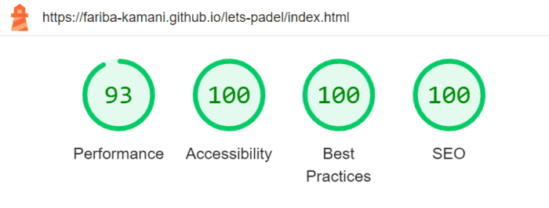

# Let's Padel -  Testing

Visit the deployed site: [Let's Padel](https://fariba-kamani.github.io/lets-padel/)

- - -

## CONTENTS

* [AUTOMATED TESTING](#automated-testing)
  * [W3C Validator](#w3c-validator)
  * [Lighthouse](#lighthouse)
* [MANUAL TESTING](#manual-testing)
  * [Common features on all pages](#common-features-on-all-pages)
  * [Home page](#home-page)
  * [Find Players page](#find-players-page)
  * [Gallery page](#gallery-page)

Testing was ongoing throughout the entire project development. Chrome DevTools was used while building to find and resolve any issues that arose and to ensure that everything was working correctly as expected. The same tools were also employed to verify that the project is responsive, visually appealing, and functions as intended on all standard screen sizes. 
The website has been tested on the following browsers: Chrome, Microsoft Edge, and Safari. Additionally, I tested the project on a VivoBook Asus laptop, iPhone 13, iPhone 14, and Samsung Galaxy A14. Furthermore, a few friends conducted additional testing on both Android and iOS mobile devices. 

### Automated testing

#### W3C Validator

  - HTML: No errors were returned for index.html, find-match.html and gallery.html when passing through the official [W3C validator](https://validator.w3.org/).

  - CSS: No errors were found for style.css when passing through the official [Jigsaw validator](https://jigsaw.w3.org/css-validator/).

#### Lighthouse

I used Lighthouse within Chrome DevTools to test the performance, accessibility, best practices, and SEO of the website. I have included the test results below.

##### Desktop Results

  * Home page

    
  
  * Find Players page

    
  
  * Gallery page

    

##### Mobile Results

 * Home page

    
  
  * Find Players page

    
  
  * Gallery page

    

### Manual testing

  #### **Common features on all pages**

  | Feature | Expected Outcome | Testing Performed | Result | Pass/Fail |
| --- | --- | --- | --- | --- |
| Favicon for the browser tab | To show on the browser tab | Opened the website | It shows on the browser tab | Pass |
| Website title | To links the user back to Home page | Clicked on the title link on all pages | It links back to Home page from all pages | Pass |
| Website title hover effect | To become yellow when hovered over for desktops | Hovered over the link | It turns yellow when hovered over | Pass |
| Dropdown navigation menu for mobiles | To drop down when clicked on | Clicked on navigation icon | navigation menu drops down | Pass |
| Fixed navigation bar with navigation menu on screens larger than tablets | To show on screens larger than tablets | Checked on screens larger than tablets | It shows as expected | Pass |
| navigation links | To direct the user to related pages | Clicked on navigation links | They all direct to their related pages | Pass |
| Showing the active page in the navigation bar with an underline | To underline the related navigation link for the active page | Clicked on the links to activate the related page | The related link to the active page becomes underlined | Pass |
| Navigation links hover effect | To become yellow with a yellow underline when hovered over for desktops | Hovered over the links | They turn yellow and a yellow underline appears | Pass |
| Footer link icons | To open in a seperate tab | Clicked on each icon | They all direct to their related links openning in a new tab | Pass |
| Footer icons hover effect | To turn yellow when hovered over for desktops | Hovered over all the footer icons | They turn yellow when hovered over | Pass |

#### **Home page**

 | Feature | Expected Outcome | Testing Performed | Result | Pass/Fail |
| --- | --- | --- | --- | --- |
| Responsive content in About section |  The paragraphs show in columns on screens larger than tablets | Opened Home page on larger screens | Content shows in three column | Pass |
| form link | To direct to Find Players page | Clicked on the link | Find Player page opens | Pass |
| Find Players button | To send to Find Players page | Clicked on Find Players button | Find Players page opens | Pass |
| Find Players button hover effect for desktops | To turn into white text and blue background when hovered over | Hovered over button | Text turns white while button background turns blue | Pass |
| Responsive content on Padel Benefits section for screens larger than tablets | The list centers in the page | Opened on screens larger than tablets | The list centers | Pass |

#### **Find Players page**

 | Feature | Expected Outcome | Testing Performed | Result | Pass/Fail |
| --- | --- | --- | --- | --- |
| Submit form | To require enteries on all fields marked with asterisk | Tried submitting without enteries | Doesn't submit and requires enteries | Pass |
| Submit form | To accept enteries only in correct format for every field | Entered wrong enterie format | Doesn't submit and requires correction | Pass |
| Vamos! button | To submit the form successfully when the form is filled in correctly| Clicked on Vamos! button after filling in the whole form| Submits the form and opens the submission page | Pass |
| Fieldset border and the legends display on mobiles | The fieldsets border are hidden and the legends are left-aligned | Opened on mobile | Shows as expected | Pass |
| Fieldset border and legends display on screens larger than tablets | To display dotted blue border for each fieldset and align the legends in the center | Opened on screens larger than tablets | Shows as expected | Pass |
| Vamos! button hover effect for desktops| To turn into white text and blue background when hovered over | Hovered over the Vamos! button| Text turns white while button background turns blue | Pass |
| Submission page | To open after submitting the form successfully | Filled in the form correctly and clicked on submit (Vamos!) button | User sends to submit page | Pass |

#### **Gallery page**

 | Feature | Expected Outcome | Testing Performed | Result | Pass/Fail |
| --- | --- | --- | --- | --- |
| Gallery images on mobiles | To show in a single column | Checked on mobile | Shows in a single column | Pass |
| Gallery images on tablets | To show in three columns | Checked on tablet sized screens | Shows in three columns | Pass |
| Gallery images on desktops | To show in four coulmns | Checked on desktops | Shows in four columns | Pass |
| Gallery images hover effect for desktops | The image to come forward and become bigger when hovered over | Hovered over all gallery images | Each comes forward and become larger when hovered over | Pass |